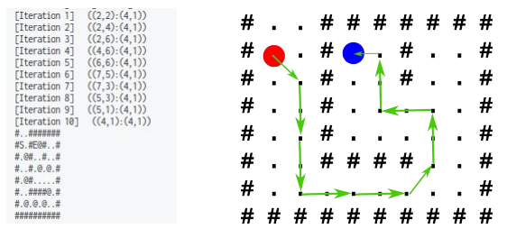

# Car Server

Server recieve cars' positon and calculates the routes and then sends back to the calculated routes to car clients.

Output of server is (S means start; E means end/target location):

This is server code for route calculating example. Client is on this repo https://github.com/codesole/car_client